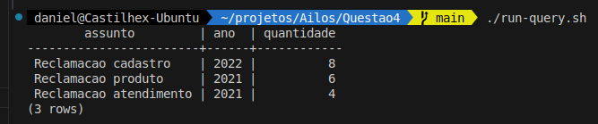

# Questão 4
De acordo com as instruções do arquivo "Questão 4.docx", foi criada uma query que retorna o assunto, o ano e a quantidade de ocorrências de atendimento, filtrando apenas assuntos com mais de três ocorrências no mesmo ano.

## Explicação da solução

Para esse teste, usei uma abordagem de conteinerização com Docker, criando um container com PostgreSQL. No arquivo docker-compose.yml, defini variáveis de ambiente para configurar nome do banco, usuário e senha, além de montar volumes para compartilhar scripts SQL entre o container e o host. Assim, durante a criação do container, os scripts são executados para gerar a tabela, inserir os dados de teste. Um arquivo de consulta tambem foi mapeada para executar a query solicitada no enunciado. Esta query será excutada posteriormente atraves de um script shell no host que usará o comando `docker exec` para executar a query no container.

A principal vantagem dessa abordagem é a facilitar a validação do teste sem precisar instalar o banco de dados e ferramentas cliente de banco de dados na máquina local. Além disso, a execução do teste é mais rápida e prática, pois basta executar o comando `docker-compose up` para criar o container e então executar a query através do script shell. Isso permite que o teste seja executado em qualquer máquina que tenha o Docker instalado e sem a necessidade de instalar dependências adicionais.

## Consulta SQL

```sql
SELECT 
    assunto, 
    ano, 
    COUNT(*) AS quantidade
FROM 
    atendimentos
GROUP BY 
    assunto, ano
HAVING 
    COUNT(*) > 3
ORDER BY 
    ano DESC, 
    quantidade DESC;
```
## Resultado da consulta no shell



## Execução do teste

> **Pré-requisitos**: Docker e Docker Compose instalados na máquina.

> Para usuarios do Windows, é necessário ter o WSL2 habilitado e configurado na máquina, alem de ter o Docker instalado na distribuição Linux do WSL2 ou via Docker Desktop.

> Não foi escrito uma versão PowerShell do script, então é necessário executar o script em um terminal bash no Wsl2.


Para executar o teste, basta seguir os passos abaixo na raiz do projeto Questao4:

```bash
docker-compose up -d 
```

```bash
./run-query.sh
```

